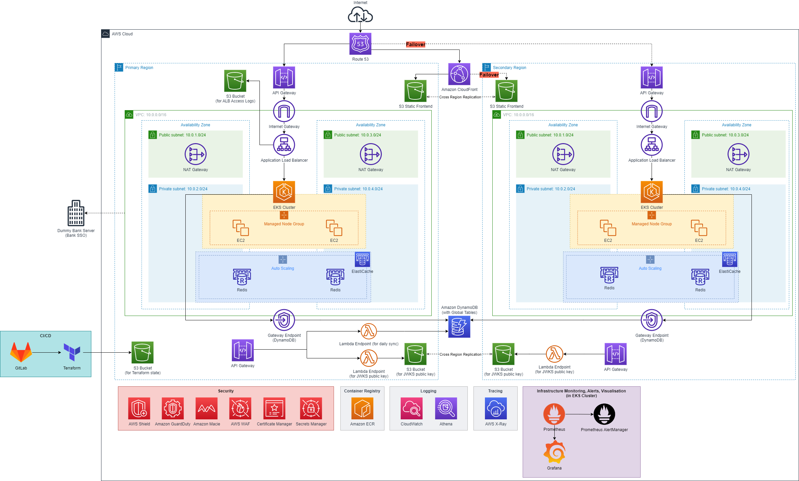
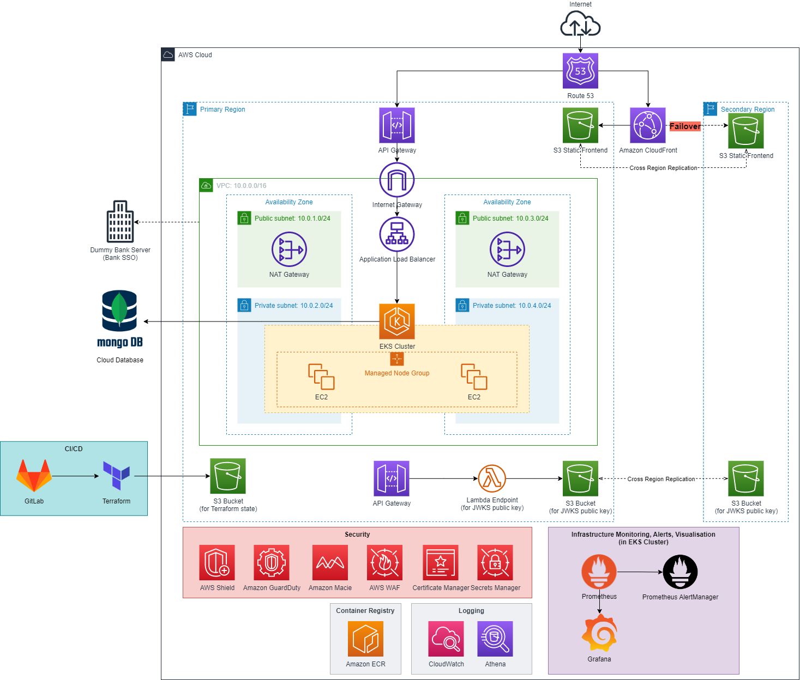
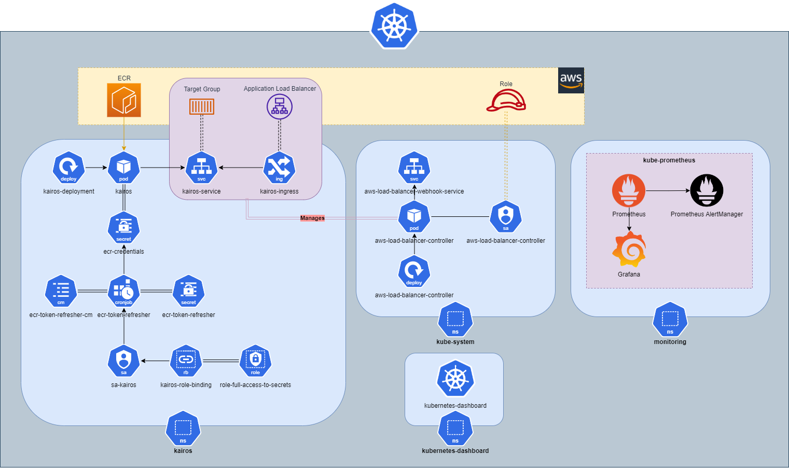
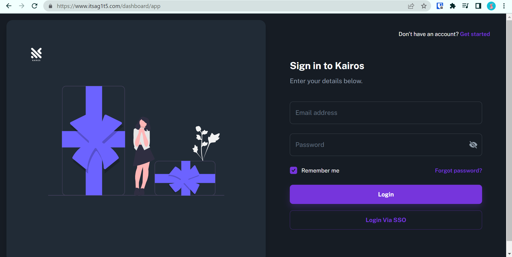
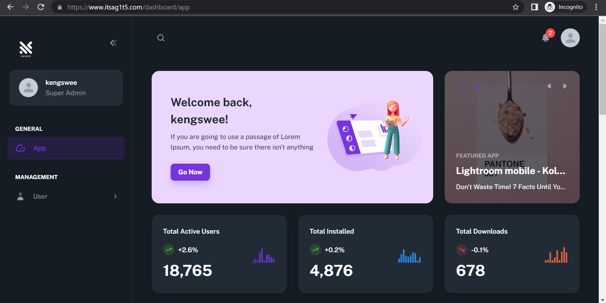
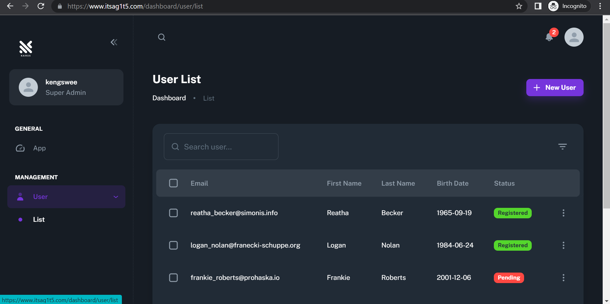
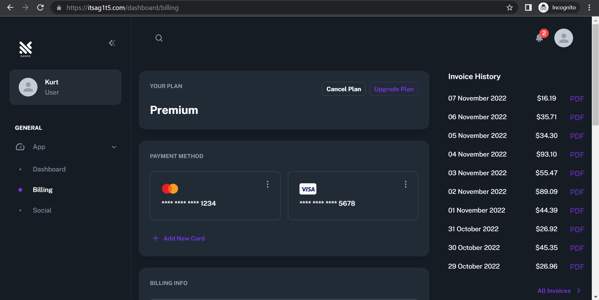
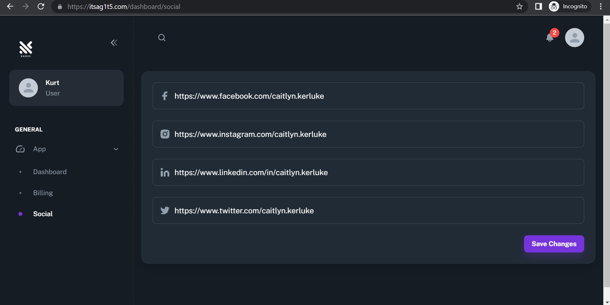

# CS301 IT Solution Architecture

## Team G1T5 - Kairos

*Link to original GitLab repository (user must be added to project first): https://gitlab.com/woonscode/kairos/*

**We did our development on GitLab as we wanted to utilise the CI/CD pipeline there. The repository is ported over from GitLab. NOTE THAT VARIOUS VALUES HAVE BEEN REMOVED FOR SECURITY AND PRIVACY PURPOSES**

## Table of Contents
* [Tech Stack (Implemented)](#tech-stack-implemented)
* [Initial Deployment Guide](#initial-deployment-guide)
* [Architecture Diagrams](#architecture-diagrams)
    * [Ideal](#ideal)
    * [Implemented](#implemented)
    * [Kubernetes](#kubernetes)
* [Screenshots of Application](#screenshots-of-application)

### Tech Stack (Implemented)
* AWS (Cloud Provider)
* Terraform (IaC)
* GitLab CI (CI/CD)
* Python Django (Backend)
* Golang (Lambda functions)
* React (Frontend)
* Docker + Kubernetes (Containerisation + Container Management)
* Prometheus (Infrastructure Metric Scraper + Alerting)
* Grafana (Infrastructure Metric Visualisation)
* Database (Cloud MongoDB)

### Initial Deployment Guide
**Pre-requisites:**
* AWS Credentials
* GitLab Account (for CI/CD pipeline)
* Terraform CLI
* `kairos-app-itsa` S3 bucket created in AWS in **Singapore (ap-southeast-1)** region
* `kairos` keypair created in AWS in **Singapore (ap-southeast-1)** region

**GitLab CI environment variables:**
* AWS_ACCESS_KEY_ID
* AWS_SECRET_ACCESS_KEY
* AWS_DEFAULT_REGION

The following services have been configured in Terraform:
* VPC with 2 private subnets, 2 public subnets, 2 NAT Gateways
* S3 buckets with appropriate configuration and logging
* EKS cluster and all associated resources such as managed node groups, IAM roles and permissions

The following services have not been configured in Terraform and have to be set up manually:
* Cloud MongoDB
* Route 53
* CloudFront
* API Gateway
* JWKS - Lambda endpoint + S3 bucket (public keys) + Secrets Manager (private keys)
* Security - Amazon GuardDuty, Macie, WAF, Certificate Manager
* ECR

1. Navigate to the **backend/terraform** directory and run `terraform apply --auto-approve`
2. Through the AWS console, navigate to the security group created by EKS that is attached to the nodes in the managed node group (not the remote-access security group) and add an inbound rule that allows traffic according to your needs
3. Upload the frontend files to the S3 bucket named `kairos-static-site` or to a bucket named after the domain you want the site to be in
4. Set up the other services as mentioned above that have not been configured in Terraform
5. Update the **main-app** manifest files and `gitlab-ci.yml` accordingly with your own AWS credentials and account ID
6. Add your AWS credentials to `AWS_ACCESS_KEY_ID` and `AWS_SECRET_ACCESS_KEY` in the `ecr-token-refresher.yml` manifest file
7. Navigate to the **kubernetes** folder and in `setup-cluster.sh`, add your AWS credentials to `AWS_ACCESS_KEY_ID`, `AWS_SECRET_ACCESS_KEY` and `account_id`
8. Run `setup-cluster.sh` in the **kubernetes** folder to setup the Kubernetes cluster

`cluster-port-forwarding.sh` in the **backend/kubernetes** directory contains the commands needed to run the Kubernetes Dashboard, Prometheus, AlertManager and Grafana accordingly

*Note: All changes to the Kubernetes cluster through manifests have to be executed manually using kubectl, whereas updates to the cloud infrastructure and backend application will be automatically deployed through the GitLab CI/CD pipeline*

## Architecture Diagrams

### Ideal

### Implemented

### Kubernetes

## Screenshots of Application

**Login Page**

**Home Dashboard**

**Admin User Management**

**User Billing**

**User Social**

